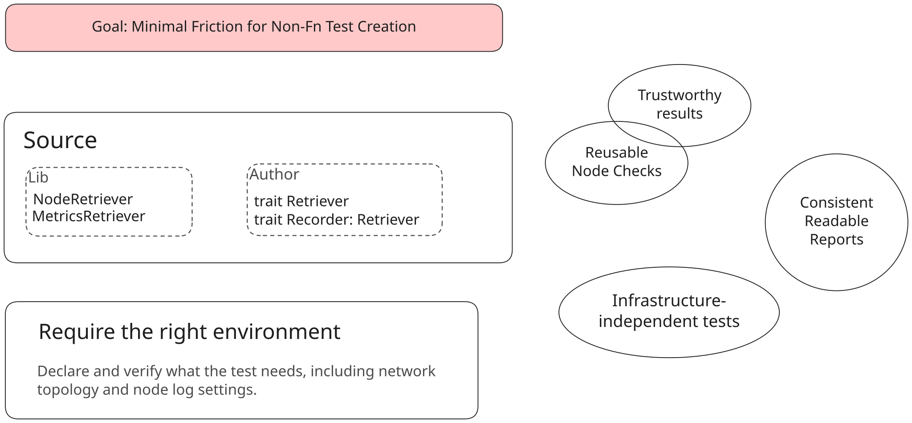
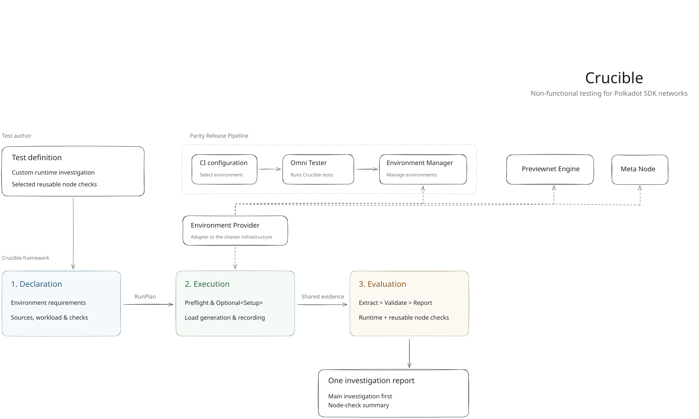

# Crucible

Non-functional testing for Polkadot SDK networks.

**Status:** Architecture and Rust API draft, not yet a working framework.

## Goals

## Architecture

[Architecture decisions](docs/architecture.md)
