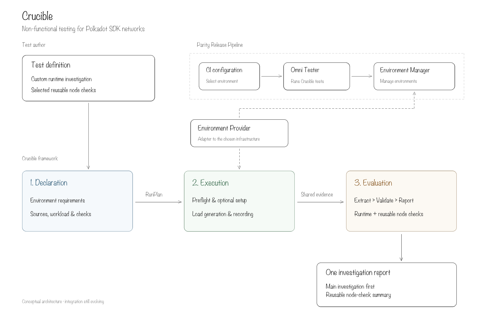

# Crucible overview

Conceptual presentation of the current architecture direction, not a finalized implementation
contract. It leaves typed-source mechanics and overall verdict aggregation out of the overview.

- [Editable Excalidraw scene](crucible-overview.excalidraw): open or import this file in Excalidraw.
- [PNG preview](crucible-overview.png): presentation image.

The overview reflects the proposed integration in the Parity Release Pipeline PRD:
Omni Tester orchestrates test runs, Environment Manager manages definitions and running instances,
and Crucible supplies the non-functional testing framework through its Environment Provider adapter.
These service boundaries are conceptual; the PRD's detailed designs remain work in progress.

The presentation separates test definition, release-pipeline context, the Environment Provider,
and Crucible's three phases into spacious fields. Declaration produces a RunPlan; execution
produces shared evidence; evaluation produces one report led by the main investigation.
Operational details and source-type mechanics are deliberately omitted.

